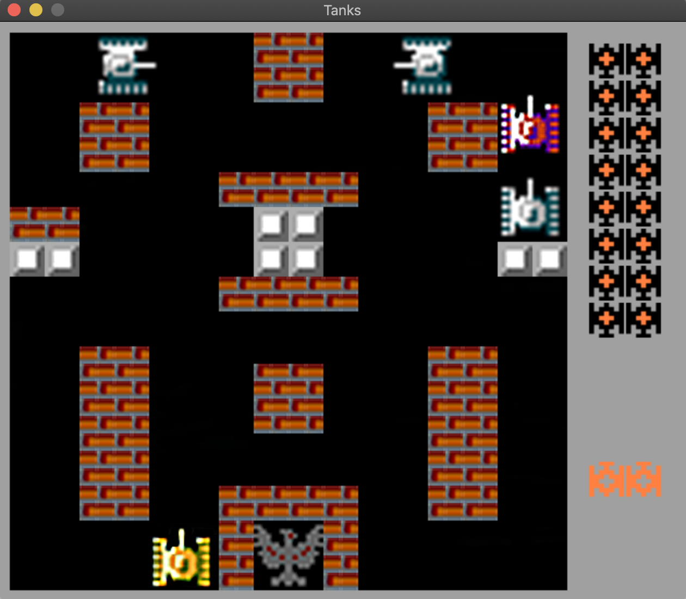

# Tanks
___
​
### Description:
    Tanks is simple BattleCity like game.
    Your goal is to defend your base from enemy tanks.

    Game reference - https://strategywiki.org/wiki/Battle_City/How_to_play

### Developers:
 [Maxim Libovych](https://github.com/mlibovych)

​
### Screenshot:
 
​
#### 1.Built with
​
 [CMake](https://cmake.org)
​
#### 2.GUI library
​
 [SDL](https://www.libsdl.org/)

### Installation:
    1. git clone --recursive https://github.com/mlibovych/tanks
    2. cmake . -Bbuild -Wdev -Werror=dev && cmake --build ./build

### How to use?
    ./tanks [-window WxH]

---